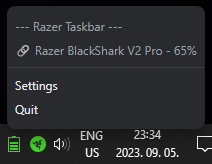

# razer-taskbar

## Summary

Display the battery state of Razer products using log messages from Razer Synapse.
Inspired by [Tekk-Know/RazerBatteryTaskbar](https://github.com/Tekk-Know/RazerBatteryTaskbar), instead of USB communication this app uses Razer Synapse logs to get the latest battery status of Razer wireless devices. This has the advantage to support more devices (headsets, mice, keyboard, etc.) without extra configuration, but also requires Razer Synapse 3 or 4 to be running.  
  
  

| ≥80% | ≥60% | ≥40% | ≥20% | ≥0% | unknown % | numeric |
|:-:|:-:|:-:|:-:|:-:|:-:|:-:|
| | | | | || |

## Requirements

* Windows (tested on Windows 10 & 11)
* `Razer Synapse 3` or `Razer Synapse 4` running in the background
* _Optional: node.js (compile time)_

## Installation

Run the setup exe. After installation the app will show its icon on the taskbar. Use the Settings menu to configure automatic startup if needed.

## Supported Hardware

* Potentially any wireless Razer device compatible with Razer Synapse 3 or 4.
* tested with Razer Blackshark V2 Pro (2023)

## Compiling

* `npm install`
* `npm run make`
* Setup exe will be created in the `out\make` directory.

## How it works

The app is monitoring the logs of Razer Synapse. The monitored file is:

* `%LOCALAPPDATA%\Razer\Synapse3\Log\Razer Synapse 3.log` for Razer Synapse 3
* `%LOCALAPPDATA%\Razer\RazerAppEngine\User Data\Logs\systray_systrayv2.log` for Razer Synapse 4

The app reads the log content throttled by the "Maximum battery update delay" setting. The code is looking for connection and battery information in the logs, and parses the latest state of each device as defined in [`razer_watcher.ts`](https://github.com/sanraith/razer-taskbar/blob/main/src/watcher/razer_watcher.ts).
If the log format of Razer Synapse changes, this file will need to be updated.

## Attributions

* RazerBatteryTaskbar: <https://github.com/Tekk-Know/RazerBatteryTaskbar>
* Battery icons are made by me. Design is based on [Dreamstale - Flaticon](https://www.flaticon.com/free-icons/battery)
